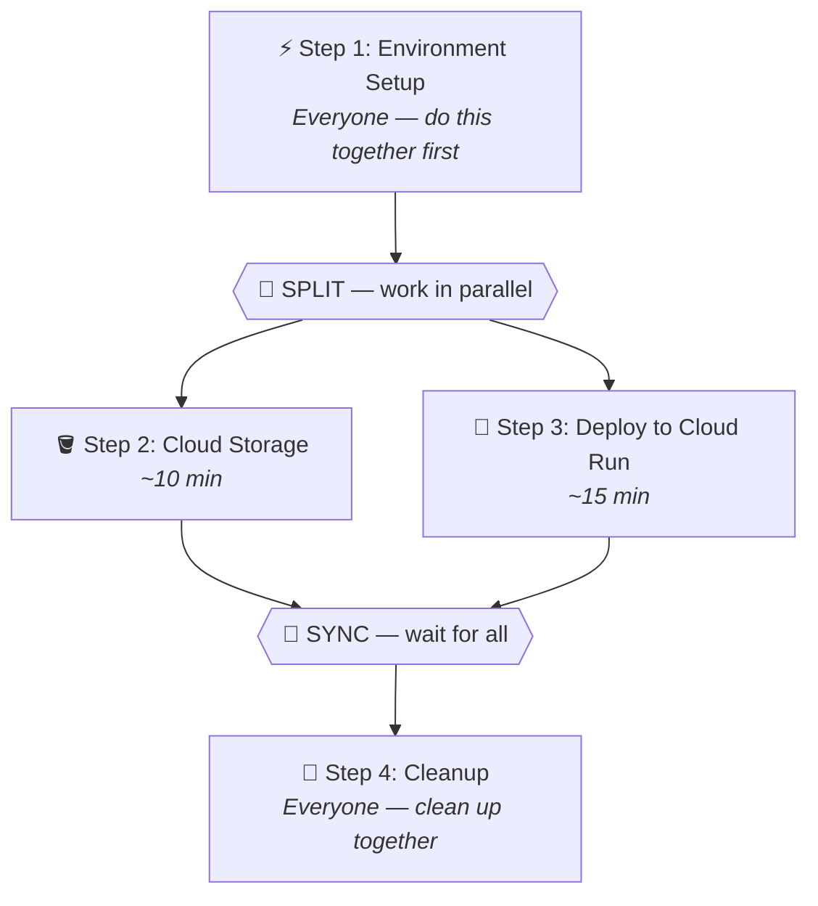

# 🚀 GCP Hackathon Codelab

⏱ Duration: ~45 minutes

Welcome to the **Google Cloud Platform Hackathon Codelab**! In this hands-on lab, you'll learn how to set up a GCP project, create Cloud Storage buckets, and deploy a containerized application to Cloud Run.

## What you'll learn

- Configure your GCP environment with the `gcloud` CLI
- Create and manage Cloud Storage buckets
- Build and deploy a containerized service to Cloud Run
- Clean up resources to avoid unexpected charges

## What you'll need

- A Google Cloud account with billing enabled
- Google Cloud SDK (`gcloud`) installed locally
- Docker installed (or use Cloud Shell)
- Basic familiarity with the terminal

## Before you begin

> 💡 **Fill in your lab variables!**
>
> Use the **Lab Variables** panel in the left sidebar to enter your Project ID, email, and other details. All code snippets in this codelab will automatically update with your values.

You will be working with the following configuration:

| Variable | Value |
|---|---|
| **Project ID** | {{PROJECT_ID}} |
| **Region** | {{REGION}} |
| **Email** | {{EMAIL}} |
| **Username** | {{USERNAME}} |
| **Bucket** | {{BUCKET_NAME}} |
| **Service Account** | {{SERVICE_ACCOUNT}} |

Once you've entered your details, click **Step 1: Environment Setup** in the sidebar to get started!

## Task Flow

Your team can split up for faster progress! Steps marked with color can be done **in parallel** — team members pick a track and go. Everyone regroups at sync points.

## Architecture Overview

The architecture for this lab is straightforward:

1. **Cloud Storage** — Store static assets and configuration files
2. **Cloud Run** — Host your containerized web service
3. **IAM** — Manage permissions via service accounts
