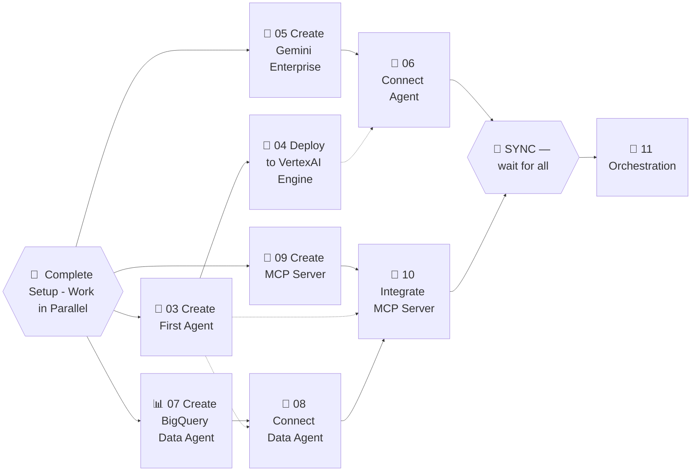

# 🚀 01 - Start Here

## Start the Lab Environment
This step is **for the table lead only**.

## Table Lead: In this step, you'll set up your lab environment.

1. Your **table lead** starts the lab and shares the credentials and project ID with all participants.
2. Open an **incognito window** and log into the [Google Cloud Console](https://console.cloud.google.com) using your lab credentials.
3. Select the lab project from the project picker.

  💡
  

    Always use an <strong>incognito window</strong> to avoid conflicts with your personal Google account.
  

## Task Dependencies

Here is a graph showing the dependencies between the lab steps. 

Each member of the team should complete **Before you begin** individually.

You should start working on the following tasks in parallel:

- **Create First Agent** 
  - All participants should do this, you'll not interfere with each other.
- **Set up Gemini Enterprise** One participant should do this.
- **Create Data Agent** One participant should do this.
- **Create MCP Server** One participant should do this.

---

**Next:** [02 - Before you begin →](agent-lab/02-before-you-begin.md)
