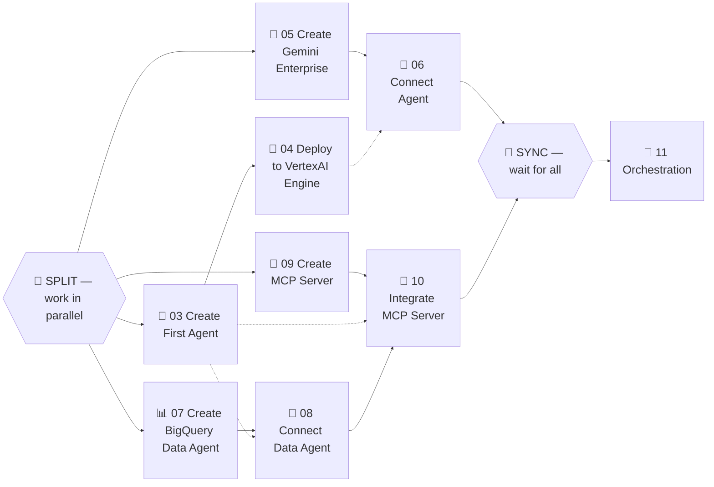

# 🚀 01 - Introduction

## Task Dependencies

Here is a graph showing the dependencies between the lab steps. Start working on **Create First Agent**, **Create Gemini Enterprise**, **Create Data Agent**, and **Create MCP Server** in parallel.

---

**Next:** [02 - Before you begin →](agent-lab/02-before-you-begin.md)
