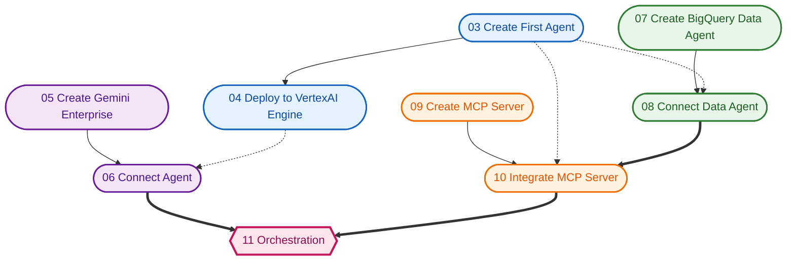

# 🚀 01 - Introduction

⏱ Full lab: ~90 minutes

Welcome to the **TR Agent Lab**! In this hands-on lab, you'll learn how to build, deploy, and integrate AI agents using the Google Agent Development Kit (ADK).

## What you'll do

- Create your first AI agent with the ADK
- Deploy it to **Vertex AI Agent Engine**
- Connect it to **Gemini Enterprise**
- Build a **Data Agent** using BigQuery
- Create and deploy a remote **MCP Server** on Cloud Run
- Integrate the MCP Server with your agent
- Explore multi-agent **orchestration**

## Prerequisites

- A Google Cloud account with billing enabled (provided by your lab lead)
- Basic familiarity with Python and the terminal
- Access to Cloud Shell

## Task Dependencies

Here is a graph showing the dependencies between the lab steps. Start working on **Create First Agent**, **Create Gemini Enterprise**, **Create Data Agent**, and **Create MCP Server** in parallel.

---

**Next:** [02 - Before you begin →](agent-lab/02-before-you-begin.md)
