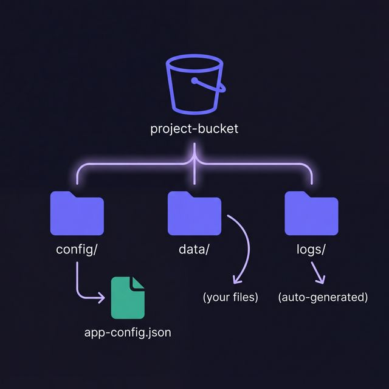

# 🪣 Step 2: Cloud Storage

<div class="duration">⏱ ~10 minutes</div>

<div class="track-indicator" data-track="1">
  <span class="track-dot"></span>
  ⚡ This step can be done <strong>in parallel</strong> — split it with your team!
</div>

In this step, you'll create a Cloud Storage bucket and upload sample files for your application.

## Create a storage bucket

Your bucket name is automatically derived from your Project ID: **{{BUCKET_NAME}}**

```bash {codejar}
# Create the bucket in your region
gcloud storage buckets create gs://{{BUCKET_NAME}} \
  --location={{REGION}} \
  --uniform-bucket-level-access \
  --project={{PROJECT_ID}}
```

## Upload sample files

Let's create a sample configuration file and upload it:

```bash {codejar}
# Create a sample config file
cat > /tmp/app-config.json << 'EOF'
{
  "project": "{{PROJECT_ID}}",
  "region": "{{REGION}}",
  "owner": "{{USERNAME}}",
  "version": "1.0.0",
  "features": {
    "caching": true,
    "logging": true
  }
}
EOF

# Upload to the bucket
gcloud storage cp /tmp/app-config.json gs://{{BUCKET_NAME}}/config/
```

## Set up bucket permissions

Grant your service account read access to the bucket:

```bash {codejar}
gcloud storage buckets add-iam-policy-binding gs://{{BUCKET_NAME}} \
  --member="serviceAccount:{{SERVICE_ACCOUNT}}" \
  --role="roles/storage.objectViewer"
```

## Verify the upload

```bash {codejar-readonly}
# List bucket contents
gcloud storage ls gs://{{BUCKET_NAME}}/config/

# View the uploaded file
gcloud storage cat gs://{{BUCKET_NAME}}/config/app-config.json
```

> ⚠️ **Cost Note:** Cloud Storage charges for storage and network egress. The amounts in this lab are minimal, but remember to clean up in Step 4.

## Understanding the bucket structure

Your bucket is organized as follows:

```
gs://{{BUCKET_NAME}}/
├── config/
│   └── app-config.json
├── data/           (created in later steps)
└── logs/           (auto-generated by Cloud Run)
```



---

**Next:** [Step 3: Deploy to Cloud Run →](deploy.md)
